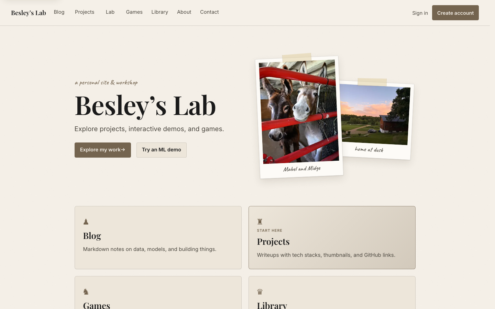
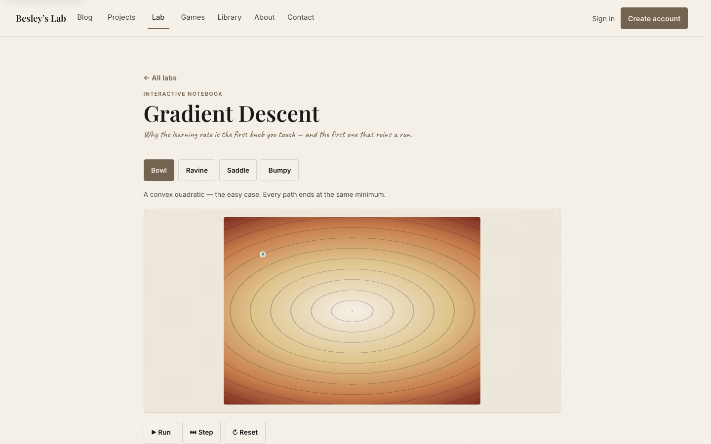
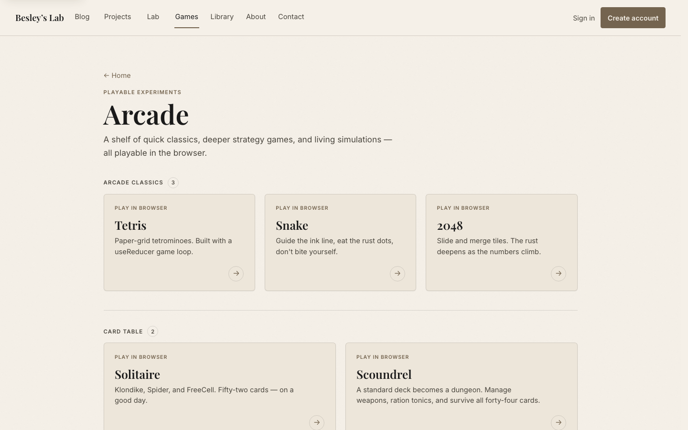
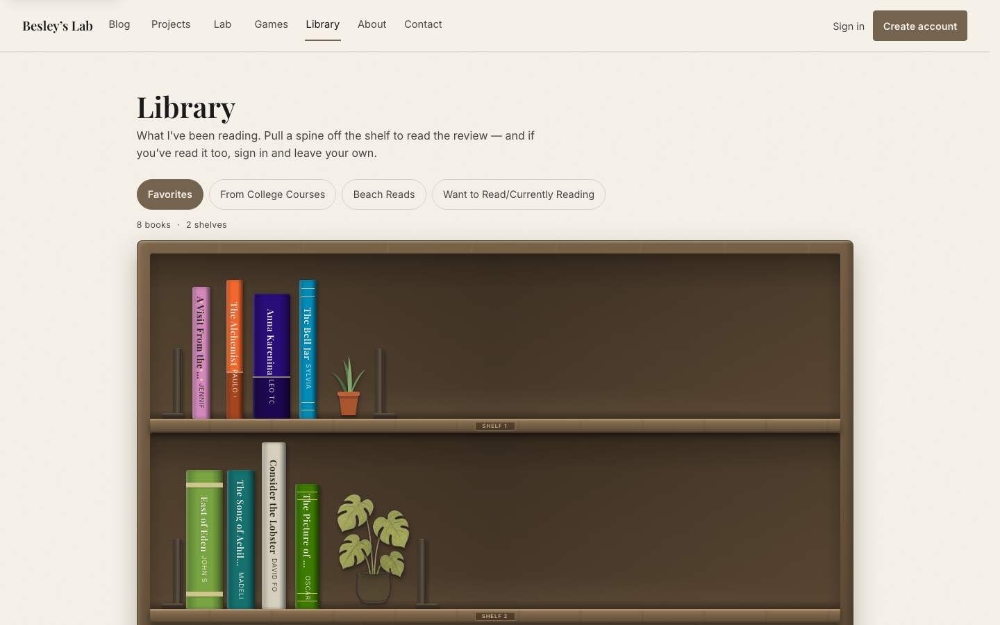
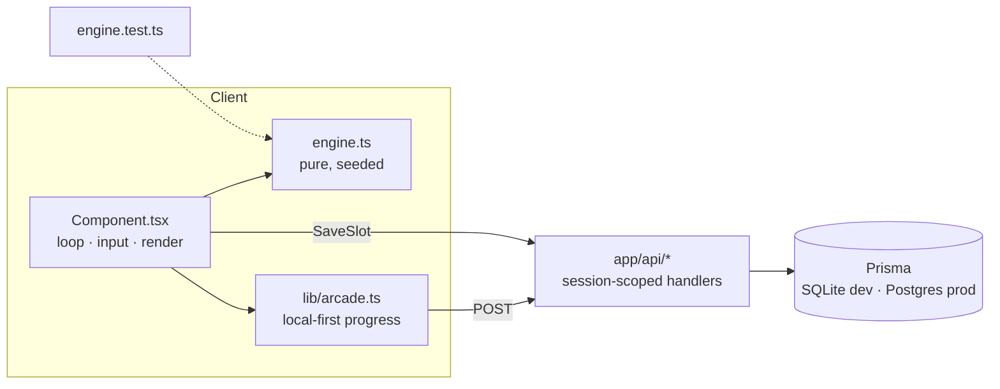

<div align="center">

# Besley's Lab

**A personal site and workshop by Samuel Besley: interactive machine-learning demos, a browser arcade, a blog, and a digital library. Every piece is built by hand.**

[](https://sbesley.com)
[](https://nextjs.org)
[](https://react.dev)
[](https://www.typescriptlang.org)
[](https://www.prisma.io)
[](https://vercel.com)

[**Visit the site**](https://sbesley.com) · [ML Lab](https://sbesley.com/lab) · [Arcade](https://sbesley.com/games) · [Resume](https://sbesley.com/resume)

<br />



</div>

---

## Overview

Besley's Lab is a full-stack Next.js app with a clear rule: **no UI kit, no chart
library, no game engine.** Every plot, simulation, card game, and animation is
written from scratch in TypeScript on top of React and Prisma.

The site has four main parts:

- **The Lab.** Nine interactive notebooks that turn ideas from my Emory
  coursework and my own study into things you can drag, step through, and break.
- **The Arcade.** Thirteen browser games, from Tetris and Solitaire to a
  deterministic Hunger Games simulator. Each game keeps its rules in a pure,
  unit-tested engine.
- **The Library.** A bookshelf drawn entirely in CSS. Visitors can pull a book's
  spine to read my review and sign in to leave their own.
- **Accounts and progression.** Saved games, achievements, personal bests, and
  replayable simulation runs, all backed by a role-based auth system.

<table>
  <tr>
    <td width="33%"></td>
    <td width="33%"></td>
    <td width="33%"></td>
  </tr>
  <tr>
    <td align="center"><sub><b>Lab:</b> gradient descent on a loss surface</sub></td>
    <td align="center"><sub><b>Arcade:</b> registry-driven game hub</sub></td>
    <td align="center"><sub><b>Library:</b> CSS bookshelf with reviews</sub></td>
  </tr>
</table>

---

## The Lab: interactive ML notebooks

Each demo is built to get one idea across, and each has a one-line takeaway on
its page.

| Demo | Topic | What it shows |
| --- | --- | --- |
| [Gradient Descent](https://sbesley.com/lab/gradient-descent) | Optimization | Race SGD, momentum, and Adam across bowl, ravine, saddle, and bumpy loss surfaces |
| [Learning-Rate Schedules](https://sbesley.com/lab/lr-schedules) | Optimization | Constant, step decay, cosine annealing, and warmup side by side |
| [k-Means Clustering](https://sbesley.com/lab/k-means) | Classic models | Place points, pick *k*, and step through assign/update by hand, including bad initializations |
| [SVM & the Kernel Trick](https://sbesley.com/lab/svm) | Classic models | Drag points around a margin, then lift non-separable data into a space where a plane works |
| [Linear vs. Logistic](https://sbesley.com/lab/regression) | Classic models | The same machinery predicting a number vs. a probability, with residuals drawn in |
| [A Net Learns XOR](https://sbesley.com/lab/xor-net) | Neural networks | A 2-2-1 network training weight by weight until the hidden layer finds the feature |
| [Bayes' Theorem](https://sbesley.com/lab/bayes) | Probability | Why a 99%-accurate test can still be wrong most of the time it says yes |
| [Markov Blog Machine](https://sbesley.com/lab/markov-blog) | Language | An n-gram chain trained live on this site's own blog posts |
| [Q-Learning Gridworld](https://sbesley.com/lab/q-learning) | Reinforcement learning | An agent learns a policy for a dangerous grid from rewards alone |

## The Arcade

| Category | Games |
| --- | --- |
| **Arcade classics** | Tetris · Snake · 2048 |
| **Card table** | Solitaire (Klondike, Spider, FreeCell) · Scoundrel |
| **Logic & strategy** | Sudoku (four difficulties, a daily puzzle, streaks) · Minesweeper · Loss-Surface Golf · Bayesian Detective |
| **Living systems** | Hunger Games Simulator · Game of Life · Evolution · Genetic Garden |

**The Hunger Games Simulator** is the largest game. You build a roster, tune six
traits per tribute, and watch a seeded simulation play out. Each run has its own
procedural biome terrain, weather and night cycles, a shrinking border,
alliances, betrayals, and a narrative feed. Because the engine is deterministic,
a saved run is stored as just `(seed, roster)`. Replaying it re-simulates the
exact same game instead of loading megabytes of turn logs.

---

## Engineering highlights

### Pure engines, thin components

Every game and demo separates its logic from React:

```
app/games/<slug>/
  engine.ts        rules only: no React, no DOM, RNG passed in as a parameter
  engine.test.ts   plain Node tests against the engine
  <Name>.tsx       owns the loop, input, and painting
  page.tsx         wraps the component in shared page chrome
```

Because of this split, the math is tested directly:

- Each loss surface's analytic gradient is checked against finite differences.
- k-means inertia is asserted never to increase.
- Minesweeper's first-click safety is checked across many seeds.
- Hunger Games runs are checked for determinism, for always reaching an ending,
  and for JSON import/export round-trips.

`npm test` runs ten test suites with no test framework, using Node's built-in
TypeScript stripping.

### Registry-driven architecture

The arcade and the Lab each read from a single registry file
([`app/games/registry.ts`](app/games/registry.ts),
[`app/lab/registry.ts`](app/lab/registry.ts)). To add a game, you add one entry
and one folder. The hub page, save-slot validation, and categories update
automatically.

### Progression that works for guests

Achievements are written to `localStorage` first, so visitors earn them without
an account. When a visitor signs in, their achievements sync to the server once
per session. Personal bests are computed in the database with a Prisma
`groupBy`, so a record holds no matter how many games come after it.



### Security

- **Scoped data access.** Routes for saves, rosters, runs, and results check the
  session and only touch rows owned by the caller. Content and account tools
  require a staff role: `EDITOR` or `ADMIN`.
- **Safe markdown.** Blog markdown is sanitized: raw script/HTML and
  `javascript:` links are stripped, and external links get
  `rel="noopener noreferrer"`.
- **Redirect and URL checks.** Login callback paths are protected against open
  redirects, including `//host` and backslash tricks. Image and project URLs are
  validated before they are saved or rendered.
- **Passwords.** Passwords are hashed with bcrypt. Input longer than bcrypt's
  72-byte limit is rejected so it can't be silently truncated.
- **Response headers.** Strict headers are set on every response: CSP
  `frame-ancestors`/`form-action`, `X-Frame-Options`, `nosniff`, and a
  locked-down `Permissions-Policy`.
- **Regression tests.** All of the above is covered by
  [`lib/security.test.ts`](lib/security.test.ts).

### Design system

The "Paper Lab" look is cream parchment, ink-black type, rust and aged-green
accents, and photos taped in like prints. It is entirely token-driven: every
color, font, and shadow is a CSS variable in
[`app/globals.css`](app/globals.css). As a result, nine alternate color themes
and a full hidden re-skin work without changing any component code.

### Performance

- Plots with more than about 1,000 marks draw to `<canvas>` instead of SVG. That
  change took the Bayes demo from roughly 1 MB of HTML to 17 KB.
- Anything random renders from a fixed seed on the server and switches to a
  random seed after mount, which avoids hydration mismatches.
- Ambient animation uses only transform and opacity, pauses in background tabs,
  and respects `prefers-reduced-motion`.

> [!TIP]
> Some parts of the site are hidden. Try typing on the arcade page, or entering
> a certain well-known cheat code anywhere.

---

## Tech stack

| Layer | Choice |
| --- | --- |
| Framework | Next.js 16 (App Router, Turbopack), React 19 |
| Language | TypeScript 5 |
| Data | Prisma 5: SQLite for local development, PostgreSQL in production |
| Auth | NextAuth.js (credentials) with bcrypt and role-based access |
| Content | Markdown via `marked`, sanitized on render |
| Styling | Hand-written CSS Modules and design tokens, with `next/font` |
| Audio | Web Audio API, synthesized at runtime (no audio files) |
| Hosting | Vercel with Vercel Analytics |

## Project structure

```
app/
  page.tsx                Home: pinned-portrait hero (motion), selected work, latest posts, field notebook
  lab/                    ML notebooks (registry.ts + one folder per demo)
    _components/          LabFrame, PointCanvas, Axes, Controls, plot scales
  games/                  Arcade (registry.ts + one folder per game)
    _components/          GameFrame, SaveSlot
  blog/  projects/        Markdown blog, project write-ups
  library/                CSS bookshelf and reader reviews
  profile/  admin/        User dashboard and trophy case; staff content tools
  api/                    Session-guarded route handlers
lib/                      auth, session guards, validation, achievements, sound
prisma/                   schema, migrations, seed
scripts/                  prepare-vercel.mjs (deploy prep), create-user.ts
docs/                     ROADMAP.md, screenshots
```

---

## Running locally

**Requirements:** Node.js 22.6 or newer (production runs on Node 24) and npm.

```bash
git clone https://github.com/sbesley04/Besleys_Lab.git
cd Besleys_Lab
npm install                 # also runs `prisma generate`

cp .env.example .env        # set NEXTAUTH_SECRET and ADMIN_* values
npm run prisma:migrate      # create the local SQLite database
npm run db:seed             # create the first admin account

npm run dev                 # http://localhost:3000
```

Generate a secret with `openssl rand -base64 32`. The default
`DATABASE_URL="file:./dev.db"` works as-is.

### Scripts

| Command | Purpose |
| --- | --- |
| `npm run dev` | Start the development server |
| `npm test` | Run all engine, security, and library test suites |
| `npm run typecheck` | `tsc --noEmit` |
| `npm run lint` | ESLint |
| `npm run build` | Deploy prep, then `next build` |
| `npm run create-user` | Create an account from the command line |

## Deployment

The site deploys to Vercel from `main`. Local development uses SQLite, which
needs no setup, while production uses Postgres. Prisma can't switch database
providers through environment variables alone, so
[`scripts/prepare-vercel.mjs`](scripts/prepare-vercel.mjs) runs at the start of
every build:

1. **Fail fast on config.** It fails the build with a clear message if
   `DATABASE_URL` (Postgres) or `NEXTAUTH_SECRET` is missing.
2. **Swap the provider.** It switches the Prisma provider to `postgresql`, but
   only inside the build container.
3. **Sync the schema.** It syncs the schema with `prisma db push`.
4. **Seed the admin.** It creates or updates the admin account from
   `ADMIN_EMAIL` and `ADMIN_PASSWORD`.

| Variable | Purpose |
| --- | --- |
| `DATABASE_URL` | Hosted Postgres connection string |
| `NEXTAUTH_SECRET` | Session signing secret |
| `NEXT_PUBLIC_SITE_URL` | Canonical URL for Open Graph tags |
| `ADMIN_EMAIL` / `ADMIN_PASSWORD` | Seeded admin credentials (optional) |

`GET /api/health` is a public liveness check that confirms the database is
reachable.

> [!NOTE]
> Deploys use `prisma db push --accept-data-loss` so they can run without
> prompts. That is safe for additive schema changes. For destructive changes,
> run a reviewed `prisma migrate` against production first.

## Roadmap

Planned next: global leaderboards, daily challenges for every game, achievement
rarity stats, public profile pages, and new Lab demos covering bias–variance,
decision trees, and attention. See [`docs/ROADMAP.md`](docs/ROADMAP.md) for the
full list.

---

<div align="center">

**Samuel Besley**, data scientist and full-stack developer

[Website](https://sbesley.com) · [LinkedIn](https://linkedin.com/in/sbesley) · [GitHub](https://github.com/sbesley04) · [Contact](https://sbesley.com/contact)

</div>
